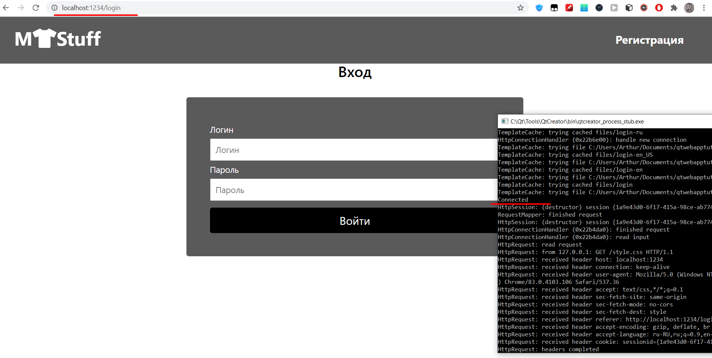

# Приложение инвентаризации вещей

Автор: Дегтярев Артур ПИ-б-о-191(1)

## Запуск

Прежде всего нужно скачать MySQL Server, MySQL Workbench, MySQL Shell(опционально)(все версии 8.0.20). Скачать все можно через [MySQL Installer](https://dev.mysql.com/downloads/installer/). 

После настройка MySQL Server, Заходим в MySQL Workbench, подключаемся и создаем базу данных users (create database users;), далее заменяем строку создания на (use users;), а после нее вставляем содержимое файла [kurs_proj.sql](https://github.com/handsomeandi/kursovaya/blob/master/qtwebapptut/QtWebTut/docroot/mysql_database/kurs_proj.sql)

Далее скачиваем репозиторий и распаковываем в любое место(папку qtwebapptut сохранить). 

В файле [sqlconnection.cpp](https://github.com/handsomeandi/kursovaya/blob/master/qtwebapptut/QtWebTut/sqlconnection.cpp) меняем поля db.setUserName() и db.setPassword() на свои данные, которые вводили при настройки MySQL Server(имя пользователя и пароль соответственно).

Следующим этапом будет подключение MySQL к QT. К сожаление в сети очень многие жалуются на проблемы, возникающие при подключении драйвера. Вот некоторые ссылки как правильно это сделать: 

[Официальная документация](https://doc.qt.io/qt-5/sql-driver.html#qmysql)

[Видео 1](https://www.youtube.com/watch?v=_u7TcjIDNzw)

[Видео 2](https://www.youtube.com/watch?v=yxy0yvZnX1Y)

[Решение возможной ошибки](https://myprogrammingnotes.com/qsqldatabase-qmysql-driver-loaded.html)

Далее собираем проект (DEBUG x64) и переходим в браузере на страницу localhost:1234/login

При удачной настройке проекта и подключении MySQL, в консоле появится сообщение Connected

